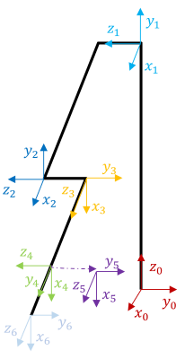
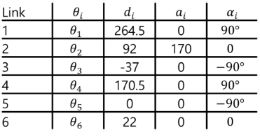
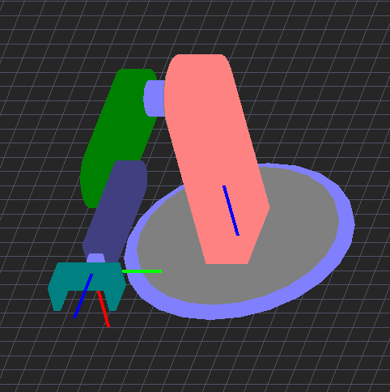
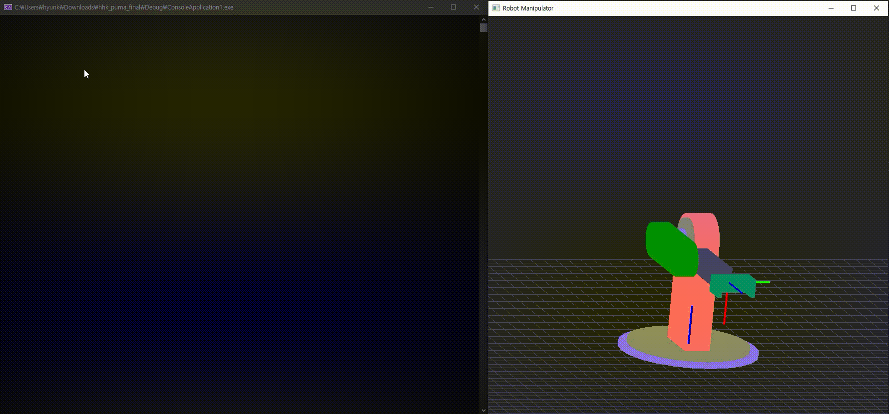

# PUMA Robot Arm Simulation
This is a term project for the **'Robot Engineering'** course at the Seoul National University of Science and Technology(**SEOULTECH**).

Base codes are provided by [Prof. Sooyoung Lee](https://eie.seoultech.ac.kr/intro/prof/?togo=list&menu=1143&profidx=02365)

## Work Condition
- VS 2019
- Reference model : [**PUMA 500 Robot Arm**](http://rutherford-robotics.com/PUMA/)
 

## Coordinate & DH Parameter
 |
--- | --- | 

**OpenGL Modeling**  

## Key description
I made 5 kinds function in this simulation

**Mode 1** : Move the coordinates of the end effector (X, Y, Z)
-   E & Q : Increase(decrease) x by 5
-   D & A : Increase(decrease) x by 5
-   W & S : Increase(decrease) z by 5

**Mode 2** : Rotate the angle of the end effector ($\theta_{4}$, $\theta_{5}$, $\theta_{6}$)
- Z & X : Rotate $\theta_{4}$ by 5
- C & V : Rotate $\theta_{5}$ by 5
- B & N : Rotate $\theta_{6}$ by 5

**Mode 3** : Move the end effector to the inputted coordinates
- I : Receive input for X, Y and Z coordinates

**Mode 4** : Rotate the end effector to the inputted coordinate
- O : Receive input for $\vec a$, $\vec o$ and $\vec n$

**Mode 5** : Move and rotate the end effector to the inputted coordinate
- P : Receive input for X, Y, Z, $\vec a$, $\vec o$ and $\vec n$

## Simulation
- Mode1
  
- Mode2
  
- Mode5
  
